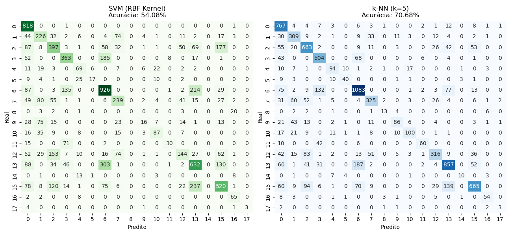

# Chess Endgame Classification: SVM vs k-NN ♟️


## 📋 Project Overview
This project applies **Supervised Machine Learning** techniques to classify the outcome of a chess endgame scenario: **King + Rook vs. King (KRK)**. 

Using the `krkopt.data` dataset (likely from the UCI Machine Learning Repository), the model predicts the game state (draw or depth-to-win) based on the coordinates of the White King, White Rook, and Black King.

## 🧠 Models & Methodology

We implemented a comparative analysis between two distinct classification algorithms:

1.  **Support Vector Machine (SVM):** Using the **RBF Kernel** to handle non-linear decision boundaries typical in chess board geometries.
2.  **k-Nearest Neighbors (k-NN):** Configured with `k=5` to classify states based on local board similarity.

### The Pipeline
1.  **Data Loading:** Parsing raw CSV data (no headers).
2.  **Preprocessing:** * **Label Encoding:** Converting board coordinates (a-h) to numeric values.
    * **Normalization (StandardScaler):** Essential for distance-based algorithms like SVM and k-NN to function correctly.
3.  **Splitting:** 70% Training / 30% Testing.
4.  **Evaluation:** Accuracy Score and Confusion Matrix visualization.

## 📊 Results

| Model | Configuration | Accuracy |
| :--- | :--- | :--- |
| **SVM** | Kernel=RBF, C=1.0 | *[Insert Accuracy here]* |
| **k-NN** | Neighbors=5 | *[Insert Accuracy here]* |

> *Note: The SVM with RBF kernel typically performs well in this domain due to its ability to map the complex spatial relationships of the chessboard into higher dimensions.*

## 📈 Visualization
The Confusion Matrices below illustrate the performance of each classifier on the test set:


*(Run the script to generate and save this image)*

## 💻 How to Run

1.  **Clone the repository:**
    ```bash
    git clone [https://github.com/Kauajr13/Machine-Learning-Labs.git](https://github.com/Kauajr13/Machine-Learning-Labs.git)
    cd Machine-Learning-Labs/Chess-Endgame-Classification
    ```

2.  **Install dependencies:**
    ```bash
    pip install -r requirements.txt
    ```

3.  **Run the script:**
    ```bash
    python main.py
    ```

---
*Developed by [Kauã Soares](https://www.linkedin.com/in/kaua-jrss13/).*
