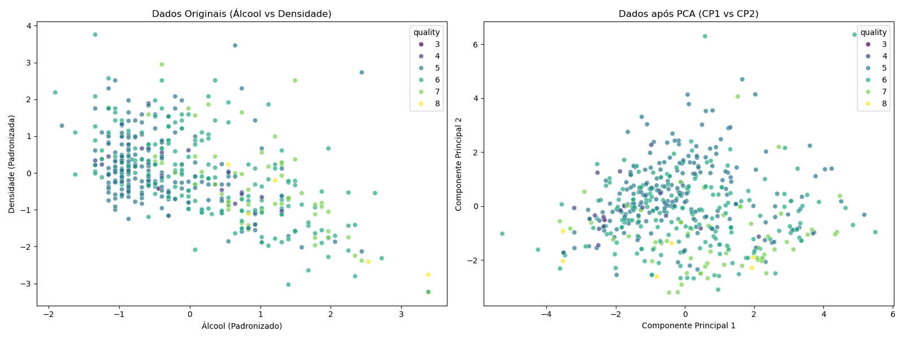

# k-NN Algorithm and PCA Analysis

Implementation of the k-Nearest Neighbors algorithm focusing on mathematical validation and dimensionality reduction using Principal Component Analysis (PCA).

## Project Overview

This project consists of two scripts designed to validate the theoretical mechanics of distance-based classification and apply them to standard datasets.

### 1. Mathematical Validation (knn.py)
A didactic implementation used to verify k-NN calculations manually against the Scikit-Learn library.
* **Dataset:** Synthetic data (Fruit classification based on Weight and Color).
* **Key Concepts:**
    * Raw Euclidean Distance calculation.
    * Manual Z-Score Standardization (feature scaling).
    * Validation of manual calculations against `sklearn.neighbors.KNeighborsClassifier`.

### 2. PCA and Classification (knn-pca.py)
Application of k-NN on the Wine dataset, utilizing PCA to reduce dimensionality for visualization purposes.
* **Dataset:** Wine Data Set (UCI Machine Learning Repository).
* **Objective:** Classify wine cultivars and visualize decision boundaries.
* **Output:** Generates `wine_comparison.png` to illustrate class separation.



## Dependencies

* Python 3.x
* NumPy
* Pandas
* Scikit-Learn
* Matplotlib
* Seaborn

## Usage

Navigate to the directory:
```bash
cd KNN-PCA-Analysis
